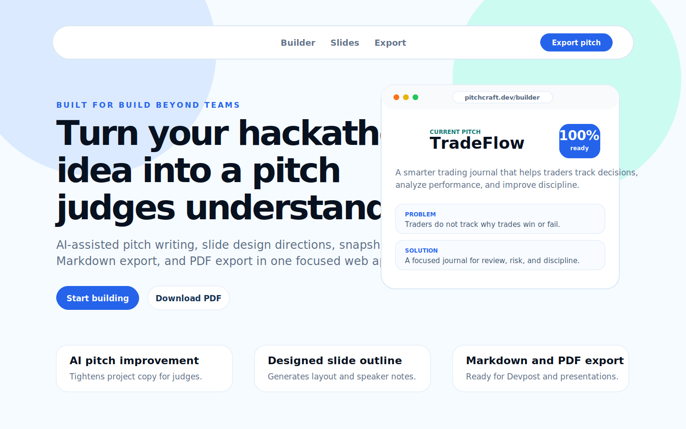

# PitchCraft Build Beyond Submission

## Project Name

PitchCraft

## Elevator Pitch

Turn your hackathon idea into a clear, judge-ready pitch in minutes.

## Project Overview

### The Idea

PitchCraft was inspired by a common hackathon problem: teams often build strong projects but struggle to explain them clearly before submission time. A useful product can lose impact if the story is unclear, the problem is vague, or the presentation feels rushed.

Build Beyond has no theme restriction, so PitchCraft focuses on helping any builder turn any project idea into a complete pitch. It gives participants a structured way to explain what they built, who it helps, why it matters, and how judges should understand the final product.

### How It Works

Users enter their project name, tagline, problem, intended audience, solution, features, tech stack, impact, presentation plan, and next steps. PitchCraft validates the pitch sections, calculates a readiness score, generates a five-slide outline, saves pitch snapshots, and exports the result as Markdown or PDF.

The app also includes backend AI support. The AI assistant can improve the project pitch and generate slide design directions with layouts, visual guidance, and speaker notes. API keys stay server-side through backend routes and Vercel serverless functions.

### Main Features

- Guided project pitch builder
- Live pitch readiness score
- Judge-focused completion checklist
- AI-assisted pitch improvement
- AI-generated slide design directions
- Five-slide presentation outline
- Saved pitch snapshots
- Markdown export
- PDF export for current pitch and snapshots
- Local draft persistence with `localStorage`
- Responsive website UI
- Custom logo and brand assets

### Technology Stack

- React
- TypeScript
- Vite
- CSS
- Node.js
- Vercel serverless functions
- OpenAI Responses API
- LocalStorage
- jsPDF
- Vitest
- Oxlint

### Intended Audience

PitchCraft is designed for Build Beyond participants, beginner hackers, student teams, solo builders, mentors, and anyone who needs to communicate a technical project clearly under hackathon time pressure.

## Project Story

### Inspiration

Hackathons reward builders who can both create and communicate. PitchCraft was inspired by the moment near the end of a hackathon when a team has a working project but still needs to explain the idea, problem, solution, technical choices, and impact clearly. Instead of starting from a blank document, PitchCraft gives builders a focused workspace for shaping that story.

### What I Learned

This project reinforced the importance of separating product logic from UI code. The pitch scoring, slide generation, exports, and AI types live in reusable TypeScript modules instead of being buried inside components. I also learned how to keep AI integration production-safe by routing OpenAI requests through backend endpoints and keeping secrets out of the frontend.

### How I Built It

PitchCraft was built as a React and TypeScript web app with Vite. The app stores drafts locally, validates pitch sections, generates slide outlines, and exports Markdown/PDF files. The backend AI routes use OpenAI through server-side code, with Vercel-compatible API routes for deployment.

### Challenges

The main challenge was making the product useful without pretending that fake AI or fake backend behavior existed. The app needed real export flows, real state persistence, real validation, and real AI endpoints. Another challenge was improving the interface so it felt like a polished website and web app, not a generic dashboard.

## Demo Materials

Required visual:



Additional brand assets:

- `public/pitchcraft-logo.svg`
- `public/pitchcraft-logo-wide.png`
- `public/pitchcraft-mark.svg`
- `public/pitchcraft-mark.png`

## Source Code

GitHub repository:

[https://github.com/giwaolusholaliafeez-byte/PitchCraft](https://github.com/giwaolusholaliafeez-byte/PitchCraft)

## Built With Tags

```text
React
TypeScript
Vite
CSS
Node.js
Vercel
OpenAI
Responses API
LocalStorage
jsPDF
Vitest
Oxlint
Frontend
Backend
Serverless
AI
Pitch Builder
Presentation
Markdown
PDF
Hackathon
Productivity
Web App
Devpost
Build Beyond
```

## Team Information

Solo submission:

- Product idea
- TypeScript pitch logic
- React frontend implementation
- Backend AI routes
- PDF and Markdown export
- Responsive website UI
- Logo and brand assets
- Testing and documentation
